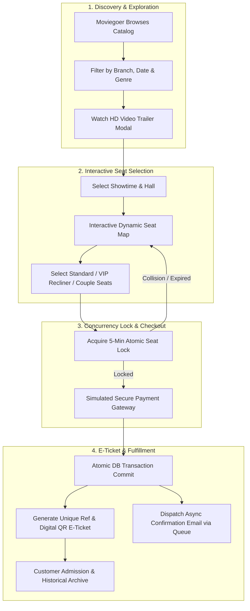

# 🎬 BJRS Cinema Ticketing System
### *One Platform. Multiple Branches. Seamless Entertainment.*

[](https://laravel.com)
[](https://react.dev)
[](https://vitejs.dev)
[](https://tailwindcss.com)
[](https://www.postgresql.org)
[](https://supabase.com)
[](https://php.net)
[](https://opensource.org/licenses/MIT)

> [!IMPORTANT]
> **Core Architectural Invariant & Zero Double-Booking Guarantee:**  
> **BJRS Cinema Ticketing System** operates on a strictly decoupled **Laravel 11 REST API** and **React 18 (Vite SPA)** architecture. High-demand blockbuster releases enforce a deterministic **5-Minute Atomic Seat Lock Engine (TTL)** backed by database transactions to guarantee **0.00% seat collisions**. All staff manager credentials and customer QR e-tickets are dispatched asynchronously through non-blocking **Laravel Mail Queues** to sustain $< 150\text{ ms}$ API response times.

---

## 📑 Table of Contents

- [💎 What is BJRS Cinema Ticketing System?](#-what-is-bjrs-cinema-ticketing-system)
- [🔄 End-to-End Ticketing & Operations Pipeline](#-end-to-end-ticketing--operations-pipeline)
- [👥 Role Matrix: Three Perspectives, One Governed Platform](#-role-matrix-three-perspectives-one-governed-platform)
- [🏗️ System Architecture & Data Flow](#️-system-architecture--data-flow)
- [💻 Technology Stack](#-technology-stack)
- [🔍 Platform Guided Tour & Feature Walkthrough](#-platform-guided-tour--feature-walkthrough)
- [⚡ Quickstart & Local Setup](#-quickstart--local-setup)
- [🔒 Security & Environment Standards](#-security--environment-standards)
- [📄 License & Credits](#-license--credits)

---

## 💎 What is BJRS Cinema Ticketing System?

High-traffic movie ticket launches often suffer from devastating failure modes: concurrent seat collisions, sluggish server-rendered pages, scheduling overlaps across regional multiplexes, and insecure manual credential distribution for branch personnel.

Before taking a customer's booking or scheduling a screening, an enterprise cinema platform must answer critical operational questions:
1. **Is the selected seat actually free**, and can it be atomically held without blocking other screens or suffering race conditions?
2. **Does the new showtime conflict** with existing film schedules, room maintenance, or mandatory cleaning buffers?
3. **Is the branch administrator strictly isolated** to their assigned multiplex without cross-branch data contamination?
4. **Are customer confirmations instantaneous**, delivering printable digital QR codes and automated email receipts asynchronously?
5. **Can executive leadership track real-time revenue and occupancy** across every branch nationwide in a single dashboard?

**BJRS Cinema Ticketing System** unifies this entire operational and customer journey into an autonomous, institutional-grade cinema management platform. Detailed technical and design foundations can be reviewed in the [PRD](file:///c:/Users/Shelley/Desktop/projects/php/cinema-ticketing-system/docs/PRD.md), [SDD](file:///c:/Users/Shelley/Desktop/projects/php/cinema-ticketing-system/docs/SDD.md), [User Flow](file:///c:/Users/Shelley/Desktop/projects/php/cinema-ticketing-system/docs/USER_FLOW.md), [User Journey](file:///c:/Users/Shelley/Desktop/projects/php/cinema-ticketing-system/docs/USER_JOURNEY.md), and [AI Developer Guidelines](file:///c:/Users/Shelley/Desktop/projects/php/cinema-ticketing-system/docs/AGENTS.md).

---

## 🔄 End-to-End Ticketing & Operations Pipeline



---

## 👥 Role Matrix: Three Perspectives, One Governed Platform

| Role / Persona | Core Mission | Domain Focus & Sourced Evidence | Authoritative Boundary |
| :--- | :--- | :--- | :--- |
| **1. Super Administrator**<br>*(Marcus, Operations Director)* | Chain-wide governance, branch provisioning, and executive intelligence. | Manages all cinema branches, provisions branch managers with auto-generated secure credentials, maintains the global film catalog, and inspects chain-wide revenue KPIs. | **Global Authority:** Full CRUD across all branches, films, staff, and global reports. |
| **2. Branch Administrator**<br>*(Alex, Branch Manager)* | Multiplex scheduling, hall setup, and local ticket sales. | Configures screening rooms (Regular vs. VIP Recliner grids), schedules conflict-free showtimes with turnaround buffers, and monitors real-time branch occupancy. | **Scoped Authority:** Restricted strictly to their assigned branch ID. |
| **3. Moviegoer / Customer**<br>*(Sarah, Cinema Enthusiast)* | Frictionless movie exploration, seat selection, and digital admission. | Searches active films, previews trailers, reserves seats via dynamic visual grid, completes simulated checkout, and downloads QR e-tickets. | **Customer Authority:** Manages own cart, profile, and ticket booking history. |

---

## 🏗️ System Architecture & Data Flow

```
┌────────────────────────────────────────────────────────────────────────┐
│                   React 18+ Client Layer (Vite SPA)                    │
│   React Router DOM | State (Zustand / Context) | TailwindCSS | Axios   │
└───────────────────────────────────┬────────────────────────────────────┘
                                    │ HTTPS / REST JSON API
                                    ▼
┌────────────────────────────────────────────────────────────────────────┐
│                   Laravel 11 Routing & Middleware                      │
│      routes/api.php ──► Sanctum Auth ──► RoleMiddleware (RBAC)         │
│                        ──► BranchScopeMiddleware                       │
└───────────────────────────────────┬────────────────────────────────────┘
                                    │ Form Requests (Validation)
                                    ▼
┌────────────────────────────────────────────────────────────────────────┐
│                      Laravel API Controllers                           │
│   AuthController | BranchController | ShowtimeController               │
│   SeatController | BookingController | MovieController | Dashboard     │
└───────────────────────────────────┬────────────────────────────────────┘
                                    │
                                    ▼
┌────────────────────────────────────────────────────────────────────────┐
│                        Service & Business Layer                        │
│   BookingService | SeatLockService | ShowtimeConflictService           │
│   CredentialDispatchService | AnalyticsService                         │
└──────────────────┬─────────────────────────────────┬───────────────────┘
                   │                                 │
                   ▼                                 ▼
┌─────────────────────────────────────┐  ┌───────────────────────────────┐
│     Async Queue & Notification      │  │        Eloquent ORM           │
│    Mailables (StaffWelcomeMail,     │  │   Models, Repositories, DB    │
│       TicketConfirmationMail)       │  │   Transactions & Optimistic/  │
│        Redis / DB Queue             │  │   Pessimistic Seat Locking    │
└─────────────────────────────────────┘  └───────────────┬───────────────┘
                                                         │
                                                         ▼
                                         ┌───────────────────────────────┐
                                         │     Supabase (PostgreSQL)     │
                                         │  Tables, Foreign Keys, Indexes│
                                         └───────────────────────────────┘
```

---

## 💻 Technology Stack

- **Frontend Application:** React 18+, Vite 5, React Router v6, Axios, Lucide React, TailwindCSS (Dark Cinema Theme).
- **Backend Application:** Laravel 11.x, PHP 8.2+, Eloquent ORM, Form Requests, Sanctum Authentication, Mailables.
- **Database & Storage:** PostgreSQL 15+ (Hosted on Supabase), Connection Pooling, Transactional Locks.
- **Queues & Asynchronous Services:** Laravel Database / Redis Queue Worker, SMTP Mailer (Mailtrap / Production SMTP).
- **Design & UI Tokens:** Responsive Dark Cinema Palette (`#0B0F17`, `#E50914`, `#1F2937`), Glassmorphic Modals, Custom Seat Matrix SVG.

---

## 🔍 Platform Guided Tour & Feature Walkthrough

### 🎟️ 1. Movie Discovery & Trailer Previews
Browse *Now Showing* and *Coming Soon* films with real-time genre filtering, search, and embedded high-definition trailer modals.

### 💺 2. Reactive Seat Grid & Live Cart
Select screening rooms with interactive visual layouts featuring curved screens, walking aisles, and tiered seat pricing (Standard, VIP Recliner, Couple).

### 💳 3. Simulated Checkout & Instant E-Tickets
Enter checkout with a 5-minute atomic hold guarantee. Complete the payment to immediately generate a printable digital e-ticket with a unique QR code and booking reference.

### 🏢 4. Super Admin Management Portal
Provision new multiplex branches and automatically dispatch onboarding credentials to new branch managers via Laravel Queues.

### 📅 5. Branch Admin Showtime Scheduler
Create screening halls and schedule conflict-free showtimes with built-in turnaround and cleaning buffers.

### 📊 6. Real-Time Occupancy & Revenue Analytics
Monitor live box office sales, occupancy rates per screening room, and top-performing films.

---

## ⚡ Quickstart & Local Setup

### Prerequisites
- **PHP:** 8.2 or higher
- **Composer:** 2.x
- **Node.js:** 18.x or 20.x LTS & **npm**
- **Database:** PostgreSQL 15+ or a [Supabase](https://supabase.com) account

### Step 1: Clone Repository
```bash
git clone https://github.com/shelley-ses/cinema-ticketing-system.git
cd cinema-ticketing-system
```

### Step 2: Backend Setup (Laravel 11)
```bash
cd backend
composer install
cp .env.example .env
php artisan key:generate

# Configure your DB and SMTP credentials in .env, then run migrations & seeders:
php artisan migrate --seed

# Start the API server:
php artisan serve --port=8000
```

### Step 3: Frontend Setup (React 18 + Vite)
```bash
# In a new terminal window:
cd frontend
npm install
cp .env.example .env

# Start the frontend dev server:
npm run dev
```

### Step 4: Asynchronous Queue Worker
```bash
# In a new terminal window inside the backend directory:
php artisan queue:work --tries=3 --timeout=90
```

---

## 🔒 Security & Environment Standards

- **Zero Secret Exposure:** Never commit `.env` files, production keys, or database credentials to version control. Both `backend/.gitignore` and `frontend/.gitignore` strictly ignore all local environment files.
- **Sanitized Templates:** Developers must copy the sanitized `.env.example` templates located in `backend/.env.example` and `frontend/.env.example` to configure local runtime environments.
- **Sanctum Token Guards:** Authentication uses short-lived tokens with stateful domain checks and role-based middleware guards.
- **Data Protection:** Passwords must be hashed using Bcrypt (cost 12), and incoming requests are sanitized via dedicated Laravel Form Requests.

---

## 📄 License & Credits

Distributed under the **MIT License**.

Built with ❤️ for modern cinema chains and moviegoers worldwide. Powered by **Laravel 11**, **React 18**, and **PostgreSQL**.