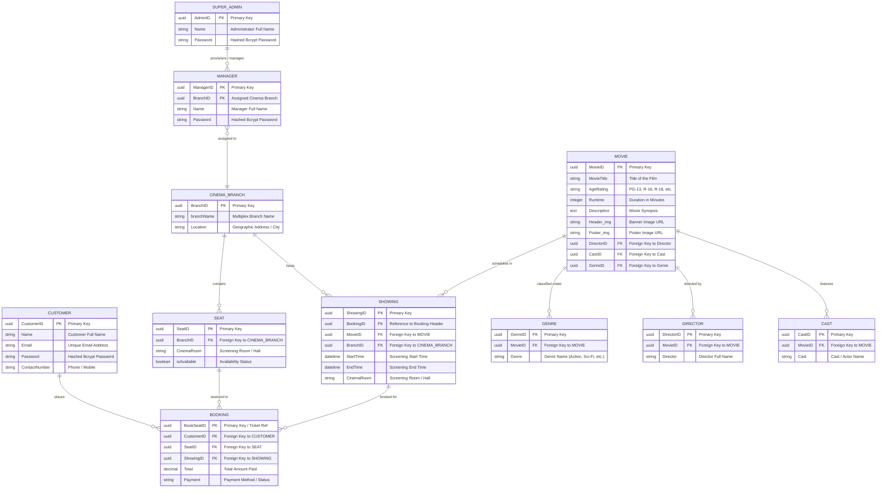

# Entity Relationship Diagram (ERD) & Database Schema
## BJRS Cinema Ticketing System

**Document Version:** 1.0.0  
**Target Database:** Supabase (PostgreSQL 15+)  
**ORM / Data Layer:** Laravel 11 Eloquent ORM  

---

## 1. Visual Entity Relationship Diagram (ERD)

The following Mermaid diagram visualizes all core entities, their primary/foreign key relationships, and cardinalities according to the system design:

---

## 2. Detailed Data Dictionary & Schema Specifications

### 2.1 Administration & Branch Domain

#### `SuperAdmin`
| Column | Type | Constraints | Description |
| :--- | :--- | :--- | :--- |
| `AdminID` | `UUID` / `BIGINT` | `PRIMARY KEY`, `NOT NULL` | Unique Super Admin identifier. |
| `Name` | `VARCHAR(255)` | `NOT NULL` | Super Administrator full name. |
| `Password` | `VARCHAR(255)` | `NOT NULL` | Bcrypt password hash. |

#### `Manager`
| Column | Type | Constraints | Description |
| :--- | :--- | :--- | :--- |
| `ManagerID` | `UUID` / `BIGINT` | `PRIMARY KEY`, `NOT NULL` | Unique Branch Manager identifier. |
| `BranchID` | `UUID` / `BIGINT` | `FOREIGN KEY` $\to$ `cinemaBranch(BranchID)` | Assigned multiplex branch. |
| `Name` | `VARCHAR(255)` | `NOT NULL` | Branch Manager full name. |
| `Password` | `VARCHAR(255)` | `NOT NULL` | Bcrypt password hash. |

#### `cinemaBranch`
| Column | Type | Constraints | Description |
| :--- | :--- | :--- | :--- |
| `BranchID` | `UUID` / `BIGINT` | `PRIMARY KEY`, `NOT NULL` | Unique cinema branch identifier. |
| `branchName` | `VARCHAR(255)` | `NOT NULL` | Name of the multiplex (e.g., *Downtown Megaplex*). |
| `Location` | `TEXT` | `NOT NULL` | Physical branch address or mall location. |

---

### 2.2 Seating & Screening Domain

#### `Seat`
| Column | Type | Constraints | Description |
| :--- | :--- | :--- | :--- |
| `SeatID` | `UUID` / `BIGINT` | `PRIMARY KEY`, `NOT NULL` | Unique physical seat identifier. |
| `BranchID` | `UUID` / `BIGINT` | `FOREIGN KEY` $\to$ `cinemaBranch(BranchID)` | Branch where the seat is installed. |
| `CinemaRoom` | `VARCHAR(100)` | `NOT NULL` | Screening room / hall (e.g., *Hall 1*). |
| `isAvailable` | `BOOLEAN` | `DEFAULT TRUE`, `NOT NULL` | Real-time seat availability indicator. |

#### `Showing`
| Column | Type | Constraints | Description |
| :--- | :--- | :--- | :--- |
| `ShowingID` / `BookingID` | `UUID` / `BIGINT` | `PRIMARY KEY`, `NOT NULL` | Unique showing schedule identifier. |
| `MovieID` | `UUID` / `BIGINT` | `FOREIGN KEY` $\to$ `Movie(MovieID)` | Film scheduled for screening. |
| `BranchID` | `UUID` / `BIGINT` | `FOREIGN KEY` $\to$ `cinemaBranch(BranchID)` | Branch hosting the screening. |
| `StartTime` | `TIMESTAMP WITH TIME ZONE` | `NOT NULL` | Scheduled screening start time. |
| `EndTime` | `TIMESTAMP WITH TIME ZONE` | `NOT NULL` | Scheduled screening end time. |
| `CinemaRoom` | `VARCHAR(100)` | `NOT NULL` | Designated auditorium / hall. |

---

### 2.3 Customer & Ticketing Domain

#### `Customer`
| Column | Type | Constraints | Description |
| :--- | :--- | :--- | :--- |
| `CustomerID` | `UUID` / `BIGINT` | `PRIMARY KEY`, `NOT NULL` | Unique registered customer ID. |
| `Name` | `VARCHAR(255)` | `NOT NULL` | Customer full name. |
| `Email` | `VARCHAR(255)` | `UNIQUE`, `NOT NULL` | Contact & notification email. |
| `Password` | `VARCHAR(255)` | `NOT NULL` | Bcrypt password hash. |
| `ContactNumber` | `VARCHAR(50)` | `NULLABLE` | Customer mobile number. |

#### `Booking`
| Column | Type | Constraints | Description |
| :--- | :--- | :--- | :--- |
| `BookSeatID` | `UUID` / `BIGINT` | `PRIMARY KEY`, `NOT NULL` | Unique booking / ticket item reference. |
| `CustomerId` | `UUID` / `BIGINT` | `FOREIGN KEY` $\to$ `Customer(CustomerID)` | Customer who purchased the booking. |
| `SeatID` | `UUID` / `BIGINT` | `FOREIGN KEY` $\to$ `Seat(SeatID)` | Seat reserved in this transaction. |
| `ShowingID` | `UUID` / `BIGINT` | `FOREIGN KEY` $\to$ `Showing(ShowingID)` | Associated screening schedule. |
| `Total` | `DECIMAL(10,2)` | `NOT NULL` | Total cost settled for the ticket. |
| `Payment` | `VARCHAR(100)` | `NOT NULL` | Payment status / method (e.g., *Paid - E-Wallet*). |

---

### 2.4 Film Catalog & Metadata Domain

#### `Movie`
| Column | Type | Constraints | Description |
| :--- | :--- | :--- | :--- |
| `MovieID` | `UUID` / `BIGINT` | `PRIMARY KEY`, `NOT NULL` | Unique film identifier. |
| `MovieTitle` | `VARCHAR(255)` | `NOT NULL` | Official movie title. |
| `AgeRating` | `VARCHAR(20)` | `NOT NULL` | Classification (G, PG, PG-13, R-16, R-18). |
| `Runtime` | `INTEGER` | `NOT NULL` | Duration in minutes. |
| `Description` | `TEXT` | `NOT NULL` | Full movie synopsis. |
| `Header_img` | `TEXT` / `VARCHAR(500)` | `NULLABLE` | Wide backdrop hero image URL. |
| `Poster_img` | `TEXT` / `VARCHAR(500)` | `NULLABLE` | Vertical film poster image URL. |
| `DirectorID` | `UUID` / `BIGINT` | `FOREIGN KEY` $\to$ `Director(DirectorID)` | Primary director key. |
| `CastID` | `UUID` / `BIGINT` | `FOREIGN KEY` $\to$ `Cast(CastID)` | Lead cast key. |
| `GenreID` | `UUID` / `BIGINT` | `FOREIGN KEY` $\to$ `Genre(GenreID)` | Primary genre key. |

#### `Genre`
| Column | Type | Constraints | Description |
| :--- | :--- | :--- | :--- |
| `GenreID` | `UUID` / `BIGINT` | `PRIMARY KEY`, `NOT NULL` | Unique genre record ID. |
| `MovieID` | `UUID` / `BIGINT` | `FOREIGN KEY` $\to$ `Movie(MovieID)` | Linked movie record. |
| `Genre` | `VARCHAR(100)` | `NOT NULL` | Genre tag (e.g., *Action*, *Sci-Fi*, *Horror*). |

#### `Director`
| Column | Type | Constraints | Description |
| :--- | :--- | :--- | :--- |
| `DirectorID` | `UUID` / `BIGINT` | `PRIMARY KEY`, `NOT NULL` | Unique director record ID. |
| `MovieID` | `UUID` / `BIGINT` | `FOREIGN KEY` $\to$ `Movie(MovieID)` | Linked movie record. |
| `Director` | `VARCHAR(255)` | `NOT NULL` | Director full name. |

#### `Cast`
| Column | Type | Constraints | Description |
| :--- | :--- | :--- | :--- |
| `CastID` | `UUID` / `BIGINT` | `PRIMARY KEY`, `NOT NULL` | Unique cast record ID. |
| `MovieID` | `UUID` / `BIGINT` | `FOREIGN KEY` $\to$ `Movie(MovieID)` | Linked movie record. |
| `Cast` | `VARCHAR(255)` | `NOT NULL` | Actor / Actress full name. |

---

## 3. Relational Integrity & Business Constraints

1. **Cascade Behavior on Branches:**
   - Deleting or archiving a `cinemaBranch` soft-deletes associated `Seat` and `Showing` records to preserve historical transaction auditability.
2. **Double-Booking Prevention:**
   - A unique composite index on `(ShowingID, SeatID)` in `Booking` prevents duplicate confirmed bookings for the same seat in the same showing.
3. **Showtime Overlap Rule:**
   - New `Showing` schedules for a given `CinemaRoom` at a `cinemaBranch` are validated against existing time ranges (`StartTime` to `EndTime`) plus a mandatory 30-minute turnaround buffer.
