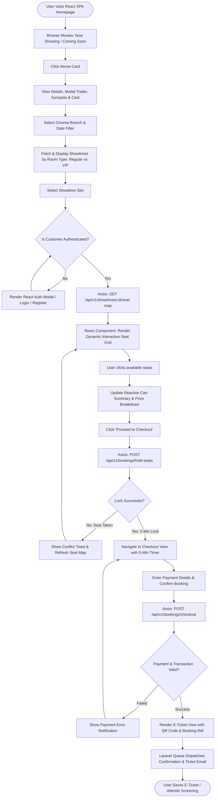
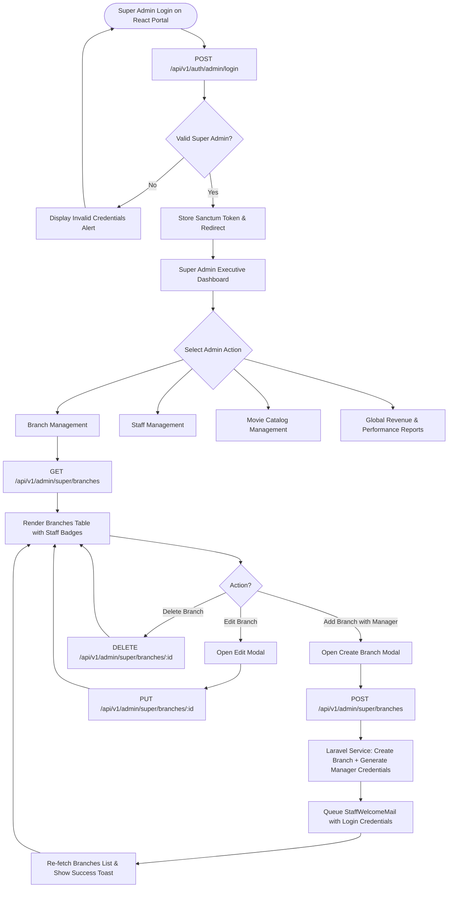
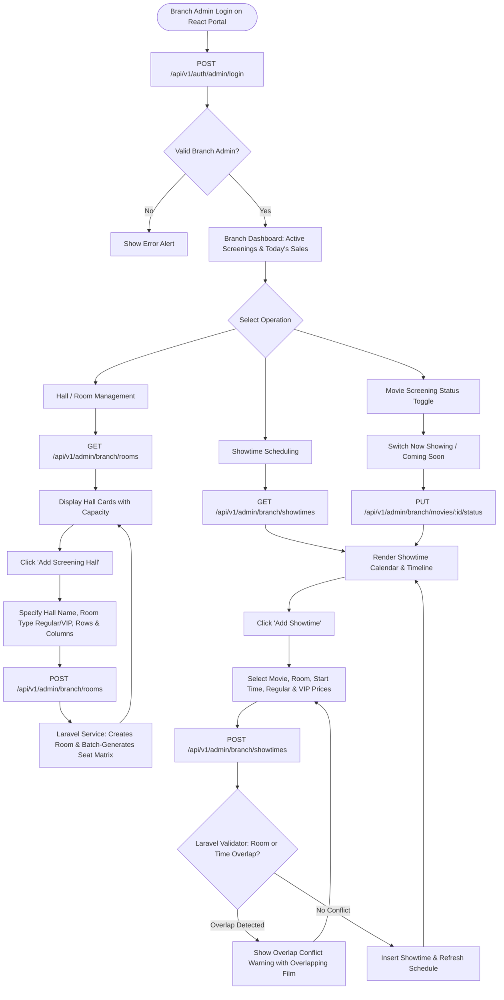
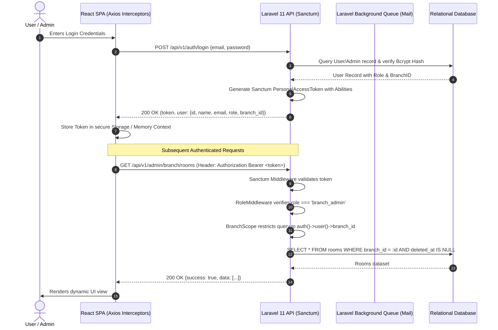

# User Flow Document
## BJRS Cinema Ticketing System

**Document Version:** 1.0.0  
**Status:** Approved  
**Target Architecture:** Laravel 11 REST API + React 18 SPA  
**Coverage:** End User / Customer Booking, Super Admin Provisioning, Branch Admin Operations, and Sanctum Authentication  

---

## 1. End User / Customer Booking Flow

This flow illustrates the complete reactive journey of a moviegoer on the React frontend interacting with the Laravel backend.

---

## 2. Super Administrator Provisioning Flow

This flow maps how the Super Administrator manages branches, provisions branch managers, and oversees global cinema operations.

---

## 3. Branch Administrator Operational Flow

This flow illustrates daily management tasks performed by a Branch Manager (screening hall setup, conflict-free scheduling, and monitoring).

---

## 4. Authentication, Token Management & Role Guard Flow

